## CIFAR-10 dataset
* Hard to fine-tune **WGAN-GP**
* sensitive to hyperparameters
* presence of **artifacts**
* hard to generate *'cat'* and *'dog'* samples
* easy to generate *'horse'* and *'planes'*
---
**Observations**   
*sampled fake images*

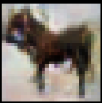
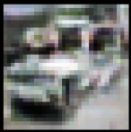
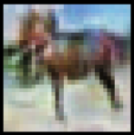
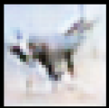
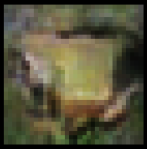

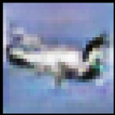
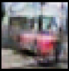
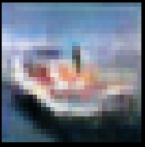
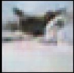
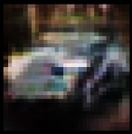

*sampled real images*

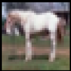
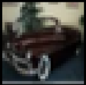
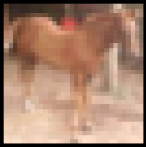

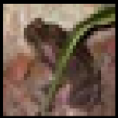

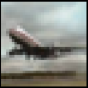
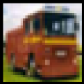
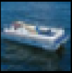
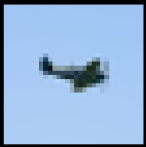
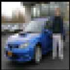

