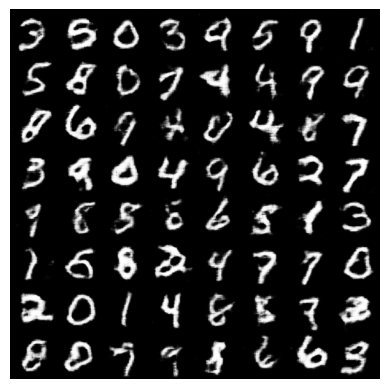
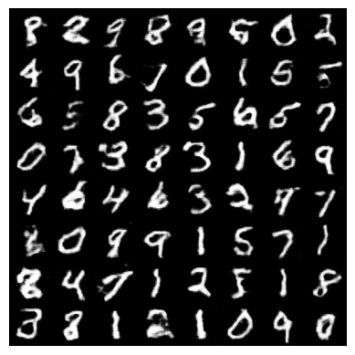
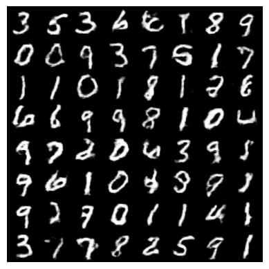
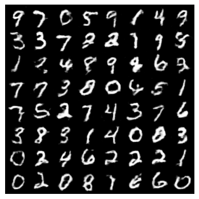
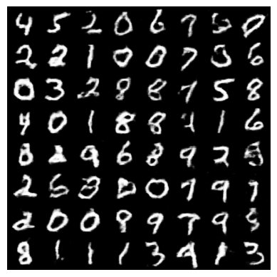
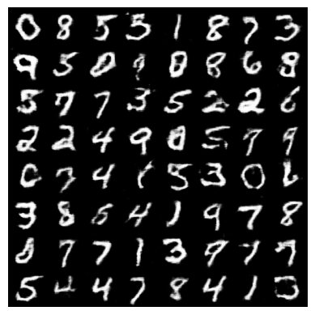

# MNIST dataset 
* Diverse samples per label
* Hard to generate digit *'8'*
* Uses Wasserstein loss objective
* `gradient_penalty()` satisfies 1-Lipschitz constraint
---

**Observations**   
Generated samples (after *30* epochs)

