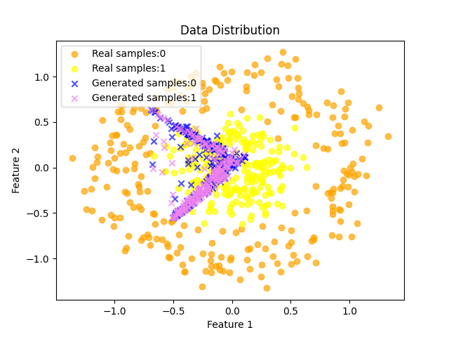
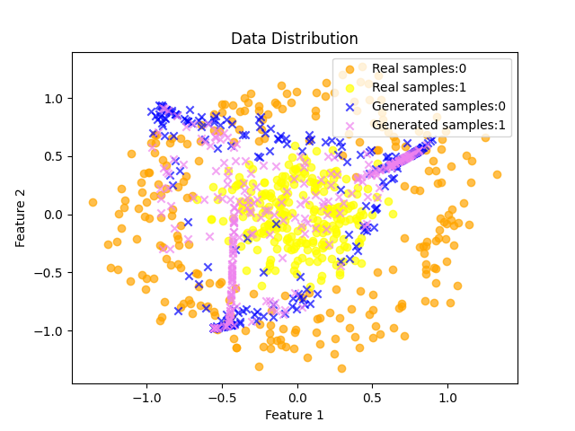
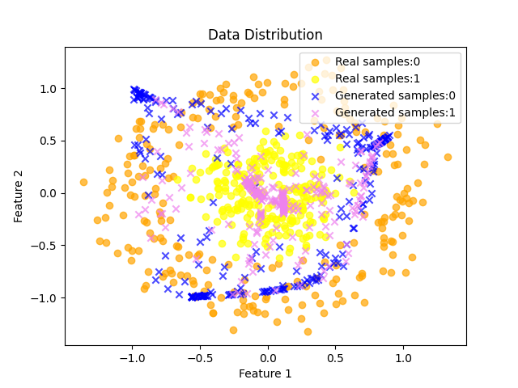
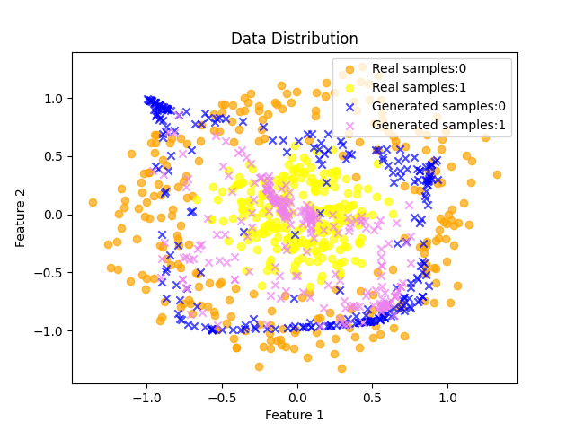
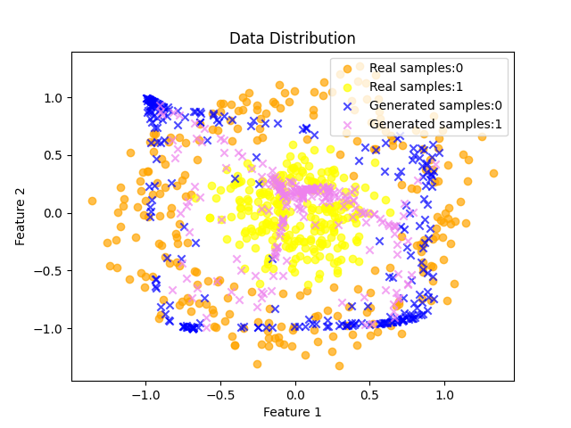
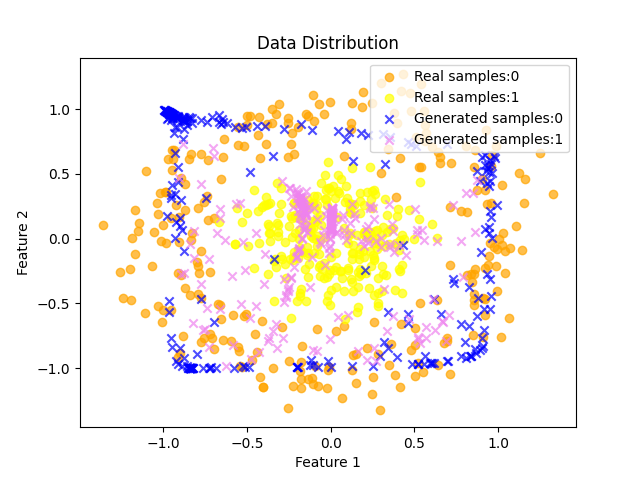

# Toy Samples
* Generated Toy samples using Sklearn
* trained on the conditional WGAN-GP
* produces "spread-out" samples
* $G_{loss} = -f(G(z|y)|y) - \sum_{i,j} |G(z_i|y_i) - G(z_j|y_j)|_2$
---

**Observations**   
Generated samples for *7000* iterations 

